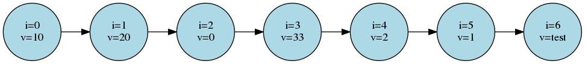
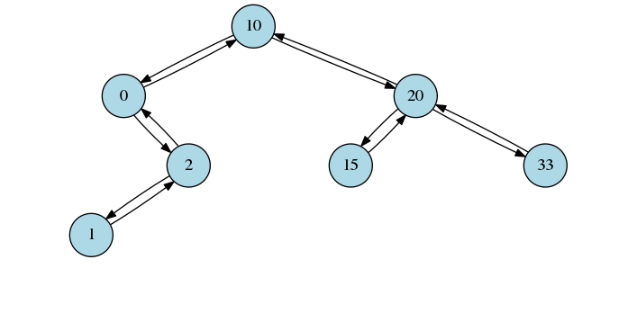
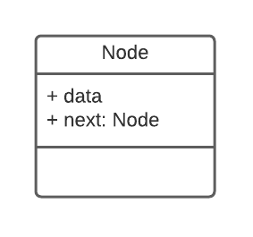
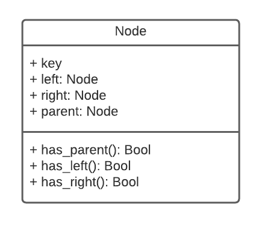

# Treevizer

Visualize node data structures using [Graphviz](https://graphviz.org/).


## How it works

Treevizer iterates over your datastructure to generate a DOT file and runs Graphviz turn it into an image. The datastructure needs to be built using Nodes.

### Examples

#### Linked list

<p align="center">
  
</p>

#### Balanced binary tree

<p align="center">
  
</p>

### Prerequisites

You need to install [Graphviz](https://graphviz.org/download/) and make sure it is in $PATH.

#### Cygwin

Don't install Graphviz in Cygwin, do a windows installation. Otherwise there will be a problem with paths.


### Installing

```
pip install treevizer
```


## Usage

The following structures are supported:

### Linked list (ll)

Require a Node class with the attributes that fulfill the following class diagram.

<p align="center">
  
</p>


### Balanced binary tree (bbt)

Require a Node class with the attributes that fulfill the following class diagram.

<p align="center">
  
</p>


### Functions

#### Structure to DOT file

```python
import Treevizer

treevizer.to_dot(root, structure_type="bbt", dot_path="tree.dot"):
    """
    Generate DOT file from node structure.

    Parameters
    ----------
    root : Node
        Root node for datastructure
    structure_type : str
        Name of the type of datastructure (default is "bbt")
    dot_path : str
        Path to generated DOT file (default is tree.dot)
    """
```


#### Structure to PNG

This also creates a DOT file.

```python
import Treevizer

treevizer.to_png(root, structure_type="bbt", dot_path="tree.dot", png_path="tree.png"):
    """
    Generate DOT file from node structure and use Graphviz to create image.

    Parameters
    ----------
    root : Node
        Root node for datastructure
    structure_type : str
        Name of the type of datastructure (default is "bbt")
    dot_path : str
        Path to generated DOT file (default is tree.dot)
    png_path : str
        Path to generated png file (default is tree.png)
    """
```


#### DOT file to PNG

```python
import Treevizer

treevizer.dot_to_png(dot_path="tree.dot", png_path="tree.png"):
    """
    Use Graphviz to create image from a DOT file.

    Parameters
    ----------
    dot_path : str
        Path to your DOT file (default is tree.dot)
    png_path : str
        Path to generated png file (default is tree.png)
    """
```


### Configure

Create `.dot.json` in root folder to change DOT configuration.  Available options can be found in [Graphviz documentation](https://graphviz.org/doc/info/attrs.html).

For example to change color of Nodes in image for balanced binary tree use the following.

```
# .dot.json
{
    "BalancedBinaryTree": {
        "node": {
            "fillcolor": "green"
        }
    }
}
```

To change size and shape of nodes and color of edges in Linked list use the following.

```
# .dot.json
{
    "LinkedList": {
        "node": {
            "shape": "square",
            "width": 1.5
        },
        "edge": {
            "color": "red"
        }
    }
}
```

## Known Errors/Warnings

[Known Errors and Warnings](https://github.com/AndreasArne/treeviz/issues/1)


## Links

- [Pypi](https://pypi.org/project/treevizer/)
- [Source code](https://github.com/AndreasArne/treeviz)


## License

This project is licensed under the MIT License - see the [LICENSE.md](LICENSE.md) file for details
